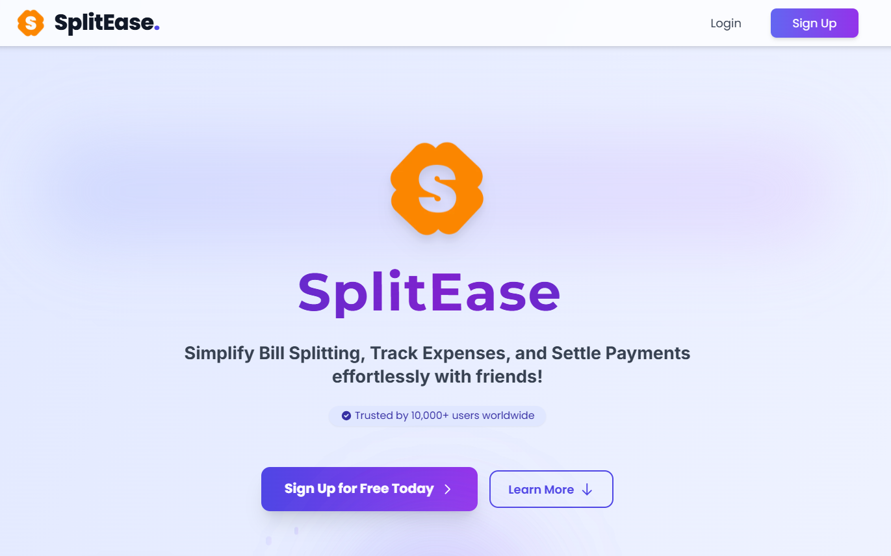

# SplitEase — Backend API



[](https://github.com/CodeTirtho97/SplitEase_backend/actions/workflows/ci.yml)
[](https://nodejs.org/)
[](https://opensource.org/licenses/ISC)

REST API and WebSocket server for [SplitEase](https://github.com/CodeTirtho97/SplitEase_frontend) — a full-stack expense-splitting application that lets friend groups track shared costs, split bills across multiple currencies, and settle debts with optimized payment flows.

---

## Table of Contents

- [Features](#features)
- [Tech Stack](#tech-stack)
- [Architecture](#architecture)
- [Database Schema](#database-schema)
- [Security](#security)
- [API Reference](#api-reference)
- [Real-time Events](#real-time-events)
- [Getting Started](#getting-started)
- [Environment Variables](#environment-variables)
- [Testing](#testing)
- [CI/CD Pipeline](#cicd-pipeline)
- [NPM Scripts](#npm-scripts)
- [Contributing](#contributing)

---

## Features

### User & Authentication
- Email/password registration and login with JWT (7-day expiry)
- Google OAuth 2.0 social login via Passport.js
- Secure password reset via tokenised email link (SHA-256 hashed token, 1-hour expiry)
- Profile picture uploads to Cloudinary
- Bi-directional friend management (adding a friend is reflected on both accounts)

### Group Management
- Create typed groups: Travel, Household, Event, Work, Friends
- Add/remove members (restricted to existing friends)
- Group-level debt summary with algorithmic debt simplification
- Soft-close groups when all debts are settled

### Expense Tracking
- Three split methods: **Equal**, **Percentage**, **Custom**
- Multi-currency support with daily exchange-rate sync (INR, USD, EUR, GBP, JPY)
- Full expense lifecycle: create → split → transact → settle
- Cascading delete: removing an expense clears its transactions

### Transactions & Settlement
- Pending transaction dashboard per user
- Settle via UPI, PayPal, or Stripe (mode recorded, no live gateway)
- Expense auto-closes when all split shares are settled
- Last 10 transactions in history with currency-normalised amounts

### Analytics & Dashboard
- Currency-normalised totals (all amounts converted to INR for aggregation)
- Settled vs pending payments, total group spend, unique co-member count
- Category breakdown and recent transaction feed

### Real-time
- Socket.IO with Redis Pub/Sub fan-out for expense, transaction, group, and notification events
- Push notifications to connected clients on expense creation, settlement, and deletion

---

## Tech Stack

| Layer | Technology |
|---|---|
| Runtime | Node.js 20.x |
| Framework | Express.js 4 |
| Database | MongoDB (Atlas) + Mongoose 8 |
| Caching / Pub-Sub | Redis (Upstash) |
| Real-time | Socket.IO 4 |
| Authentication | JWT + Passport.js (Google OAuth 2.0) |
| File Storage | Cloudinary + Multer |
| Email | Nodemailer (SMTP) |
| Security | Helmet, bcryptjs (12 rounds), express-rate-limit, express-validator |
| Scheduling | node-cron (daily exchange rate sync) |
| Logging | Winston |
| API Docs | Swagger (swagger-jsdoc + swagger-ui-express) |
| Testing | Jest 29, Supertest, mongodb-memory-server |
| Linting | ESLint 8 |

---

## Architecture

The codebase follows a strict **Route → Controller → Service → Model** layered pattern. Each layer has a single responsibility; no layer skips another.

```
backend/
├── config/
│   ├── db.js               # Mongoose connection
│   ├── passport.js         # Google OAuth strategy
│   ├── redis.js            # Redis client, session helpers, rate limiter, cache middleware
│   ├── socket.js           # Socket.IO init + Redis Pub/Sub channel handlers
│   └── swagger.js          # OpenAPI spec configuration
│
├── controllers/            # HTTP layer — parses req, calls service, sends res
│   ├── authController.js
│   ├── dashboardController.js
│   ├── expenseController.js
│   ├── groupController.js
│   ├── profileController.js
│   └── transactionController.js
│
├── middleware/
│   ├── authMiddleware.js   # JWT verification + Redis session validation
│   ├── multer.js           # Cloudinary-backed file upload
│   └── validateObjectId.js # ObjectId format guard for URL params
│
├── models/
│   ├── User.js
│   ├── Group.js
│   ├── Expense.js
│   ├── Transaction.js
│   └── ExchangeRate.js
│
├── routes/
│   ├── authRoutes.js
│   ├── dashboardRoutes.js
│   ├── expenseRoutes.js
│   ├── groupRoutes.js
│   ├── healthRoutes.js
│   ├── profileRoutes.js
│   └── transactionRoutes.js
│
├── services/               # Business logic — no req/res, fully unit-testable
│   ├── authService.js
│   ├── analyticsService.js
│   ├── dashboardService.js
│   ├── exchangeRateService.js
│   ├── expenseService.js
│   ├── groupService.js
│   ├── profileService.js
│   └── transactionService.js
│
├── utils/
│   ├── AppError.js         # Operational error class hierarchy (ValidationError, NotFoundError, …)
│   ├── constants.js        # Shared enums: currencies, group types, payment modes, expense types
│   ├── cronJobs.js         # Scheduled tasks (exchange rate refresh — daily at midnight)
│   ├── debtSimplifier.js   # Greedy net-balance debt simplification algorithm
│   ├── logger.js           # Winston logger (info/warn/error levels)
│   ├── sendEmail.js        # Nodemailer singleton transporter
│   ├── socketEvents.js     # Socket.IO event publishers
│   └── splitCalculator.js  # Equal / Percentage / Custom split logic
│
├── tests/
│   ├── setup/
│   │   ├── globalSetup.js      # Starts MongoMemoryServer before all suites
│   │   ├── globalTeardown.js   # Stops MongoMemoryServer after all suites
│   │   ├── jestSetup.js        # Per-file mongoose connect + collection wipe
│   │   └── setEnvVars.js       # Sets all env vars before any module loads
│   ├── __mocks__/
│   │   └── redisMock.js        # Full Redis mock (session, cache, pub/sub)
│   ├── utils/
│   │   ├── splitCalculator.test.js
│   │   └── debtSimplifier.test.js
│   ├── services/
│   │   ├── group.test.js
│   │   ├── expense.test.js
│   │   └── transaction.test.js
│   ├── auth.test.js
│   └── profile.test.js
│
├── .github/workflows/ci.yml   # GitHub Actions CI pipeline
├── .eslintrc.js
├── jest.config.js
├── jestTestSequencer.js        # Deterministic test execution order
└── server.js                   # Express app + HTTP server bootstrap
```

### Request lifecycle

```
HTTP Request
    └─► Route (express Router)
            └─► Middleware (auth, rate-limit, validation, cache)
                    └─► Controller (parse req, call service)
                            └─► Service (business logic, DB queries)
                                    └─► Model (Mongoose)
                                ◄── throws AppError on failure
                        ◄── formats and sends res.json()
            ◄── global error handler catches AppError → standard { message } shape
```

---

## Database Schema

### User
| Field | Type | Notes |
|---|---|---|
| fullName | String | required |
| email | String | unique, indexed |
| gender | String | Male / Female / Other |
| password | String | bcrypt, 12 rounds |
| profilePic | String | Cloudinary URL |
| friends | [ObjectId] | ref: User, bi-directional |
| paymentMethods | [Object] | { type, identifier } |
| resetPasswordToken | String | SHA-256 hash |
| resetPasswordExpires | Date | 1-hour TTL |

### Group
| Field | Type | Notes |
|---|---|---|
| name | String | max 30 chars |
| description | String | max 100 chars |
| type | String | Travel / Household / Event / Work / Friends |
| members | [ObjectId] | ref: User, includes creator |
| createdBy | ObjectId | ref: User |
| completed | Boolean | true when all debts settled |

### Expense
| Field | Type | Notes |
|---|---|---|
| payer | ObjectId | ref: User (who paid) |
| participants | [ObjectId] | ref: User (excludes payer) |
| totalAmount | Number | |
| currency | String | INR / USD / EUR / GBP / JPY |
| description | String | max 30 chars |
| splitMethod | String | Equal / Percentage / Custom |
| splitDetails | [Object] | { userId, amountOwed, transactionId } |
| groupId | ObjectId | ref: Group, optional |
| type | String | expense category |
| expenseStatus | Boolean | true when all splits settled |

### Transaction
| Field | Type | Notes |
|---|---|---|
| transactionId | String | URL-safe UUID (replaces bcrypt hash) |
| expenseId | ObjectId | ref: Expense |
| sender | ObjectId | ref: User (owes money) |
| receiver | ObjectId | ref: User (is owed) |
| amount | Number | |
| currency | String | |
| mode | String | UPI / PayPal / Stripe |
| status | String | Pending / Success / Failed |

### ExchangeRate
| Field | Type | Notes |
|---|---|---|
| base | String | INR |
| rates | Map | currency → rate |
| timestamp | Date | updated daily at midnight |

---

## Security

| Measure | Implementation |
|---|---|
| Password hashing | bcryptjs, **12 salt rounds** everywhere |
| Token auth | JWT (7-day expiry) + Redis session validation on every request |
| Security headers | `helmet()` + custom `Cross-Origin-*` headers, applied before all routes |
| CORS | Allowlist: `localhost:3000` + `FRONTEND_URL` env var |
| Rate limiting | `express-rate-limit` on auth, profile, group, and expense routes |
| Input validation | `express-validator` at route layer + service-layer ObjectId guards |
| Password reset | SHA-256 hashed token stored in DB; raw token only in email link |
| Anti-enumeration | `forgotPassword` returns 200 for unknown emails (no account disclosure) |
| File uploads | Multer type/size validation before Cloudinary upload |
| Graceful shutdown | `server.close()` → Redis shutdown → `process.exit(0)` on SIGINT |

---

## API Reference

Interactive Swagger docs are served at `/api/docs` when the server is running.

### Authentication — `/api/auth`

| Method | Path | Auth | Description |
|---|---|---|---|
| POST | `/signup` | — | Register new user |
| POST | `/login` | — | Login, returns JWT |
| GET | `/google/login` | — | Redirect to Google OAuth |
| GET | `/google/callback` | — | Google OAuth callback |
| POST | `/logout` | JWT | Invalidate session |
| POST | `/forgot-password` | — | Send password reset email |
| POST | `/reset-password` | — | Reset password with token |

### Profile — `/api/profile`

| Method | Path | Auth | Description |
|---|---|---|---|
| GET | `/me` | JWT | Get own profile |
| PUT | `/update` | JWT | Update name / gender |
| POST | `/upload` | JWT | Upload profile picture |
| PUT | `/change-password` | JWT | Change password |
| POST | `/add-friend` | JWT | Add friend by ID (bi-directional) |
| POST | `/search-friends` | JWT | Search users by name |
| DELETE | `/delete-friend/:friendId` | JWT | Remove friend |
| POST | `/add-payment` | JWT | Add payment method |
| DELETE | `/delete-payment/:paymentId` | JWT | Remove payment method |

### Groups — `/api/groups`

| Method | Path | Auth | Description |
|---|---|---|---|
| POST | `/create` | JWT | Create group |
| GET | `/mygroups` | JWT | List user's groups with stats |
| GET | `/:groupId` | JWT | Group detail, expenses, transactions |
| PUT | `/edit/:groupId` | JWT | Edit description / members / status |
| DELETE | `/delete/:groupId` | JWT | Delete group and cascade |
| GET | `/friends` | JWT | List user's friends |
| GET | `/:groupId/debt-summary` | JWT | Optimised settlement plan |

### Expenses — `/api/expenses`

| Method | Path | Auth | Description |
|---|---|---|---|
| POST | `/create` | JWT | Create expense + transactions |
| GET | `/group/:groupId` | JWT | List expenses for a group |
| GET | `/my-expenses` | JWT | List user's expenses (payer or participant) |
| GET | `/expense/:expenseId` | JWT | Single expense detail |
| DELETE | `/delete/:expenseId` | JWT | Delete expense + cascade transactions |
| GET | `/summary` | JWT | Expense summary analytics |
| GET | `/recent` | JWT | Recent expenses |
| GET | `/breakdown/:currency` | JWT | Category breakdown in given currency |

### Transactions — `/api/transactions`

| Method | Path | Auth | Description |
|---|---|---|---|
| GET | `/pending` | JWT | Pending transactions (user as sender) |
| GET | `/history` | JWT | Last 10 settled/failed transactions |
| PUT | `/:transactionId/settle` | JWT | Settle or fail a transaction |
| GET | `/recent` | JWT | Recent transactions for dashboard |

### Dashboard — `/api`

| Method | Path | Auth | Description |
|---|---|---|---|
| GET | `/stats` | JWT | Aggregated dashboard statistics |

### Health — `/api/health`

| Method | Path | Auth | Description |
|---|---|---|---|
| GET | `/` | — | Liveness probe (returns `{ status: "ok" }`) |

---

## Real-time Events

Socket.IO events are published via Redis Pub/Sub and forwarded to connected clients. Clients must authenticate their socket connection with a valid JWT.

| Event | Channel | Payload |
|---|---|---|
| `expense_created` | Group room + individual participant rooms | expense id, description, amount, currency, payer |
| `expense_deleted` | Group room + participant rooms | expense id, description |
| `transaction_settled` | sender + receiver rooms | transaction id, amount, currency, status, mode |
| `transaction_failed` | sender + receiver rooms | transaction id, amount, currency, status |
| `notification` | individual user room | type, title, message, metadata |
| `expense_completed` | expense payer room | expense id (when all splits settled) |

---

## Getting Started

### Prerequisites

- **Node.js** v20+ — [nodejs.org](https://nodejs.org/)
- **MongoDB** — [Atlas](https://www.mongodb.com/atlas) (free tier works) or local instance
- **Redis** — [Upstash](https://upstash.com/) (free tier) or local instance
- **Google OAuth credentials** — [Google Cloud Console](https://console.cloud.google.com/)
- **Cloudinary account** — [cloudinary.com](https://cloudinary.com/)
- **ExchangeRates API key** — [exchangerates-api.io](https://exchangerates-api.io/)
- **SMTP credentials** — Gmail App Password or any SMTP provider

### Installation

```bash
# Clone the repository
git clone https://github.com/CodeTirtho97/SplitEase_backend.git
cd SplitEase_backend

# Install dependencies
npm install

# Copy the example env file and fill in your values
cp .env.example .env
```

### Running the server

```bash
# Development (hot-reload via nodemon)
npm run dev

# Production
npm start
```

The server starts on the port defined in `PORT` (default `5000`).
Swagger docs are available at `http://localhost:5000/api/docs`.

---

## Environment Variables

Copy `.env.example` to `.env` and set all values before starting the server.

| Variable | Required | Description |
|---|---|---|
| `PORT` | No | HTTP port (default: `5000`) |
| `NODE_ENV` | No | `development` / `production` / `test` |
| `MONGO_URI` | **Yes** | MongoDB connection string |
| `JWT_SECRET` | **Yes** | Min 32-char random string for JWT signing |
| `REDIS_URL` | **Yes** | Redis connection URL (`rediss://…`) |
| `FRONTEND_URL` | **Yes** | Allowed CORS origin for the frontend |
| `BACKEND_GOOGLE_CALLBACK_URL` | **Yes** | Full URL for OAuth callback (`/api/auth/google/callback`) |
| `GOOGLE_CLIENT_ID` | **Yes** | Google OAuth client ID |
| `GOOGLE_CLIENT_SECRET` | **Yes** | Google OAuth client secret |
| `CLOUDINARY_CLOUD_NAME` | **Yes** | Cloudinary cloud name |
| `CLOUDINARY_API_KEY` | **Yes** | Cloudinary API key |
| `CLOUDINARY_API_SECRET` | **Yes** | Cloudinary API secret |
| `EMAIL_USER` | **Yes** | SMTP sender email address |
| `EMAIL_PASS` | **Yes** | SMTP app password |
| `EXCHANGE_RATE_URL` | No | ExchangeRates API base URL |
| `EXCHANGERATES_API_KEY` | No | ExchangeRates API key |
| `BASE_CURRENCY` | No | Base currency for rate conversion (default: `INR`) |

---

## Testing

Tests use **Jest** with **mongodb-memory-server** — no external MongoDB or Redis connection is required. Redis is fully mocked.

### Running tests

```bash
# Run full test suite (lint + all tests — recommended before every commit)
npm run validate

# Run all tests only
npm test

# Unit tests (pure functions — splitCalculator, debtSimplifier)
npm run test:unit

# Integration tests (service + HTTP route tests against in-memory MongoDB)
npm run test:integration

# Full suite with coverage report
npm run test:coverage
```

### Test structure

```
tests/
├── setup/
│   ├── globalSetup.js      # Spins up MongoMemoryServer once for all suites
│   ├── globalTeardown.js   # Tears down MongoMemoryServer after all suites
│   ├── jestSetup.js        # Connects Mongoose; wipes collections between files
│   └── setEnvVars.js       # Injects all env vars before any module loads
├── __mocks__/
│   └── redisMock.js        # Replaces config/redis — storeSession, validateSession, etc.
├── utils/
│   ├── splitCalculator.test.js   # 13 tests — Equal, Percentage, Custom splits + float tolerance
│   └── debtSimplifier.test.js    # 13 tests — empty input, circular debts, net balance, reduction %
├── services/
│   ├── group.test.js             # 12 tests — CRUD, debt summary, authorisation
│   ├── expense.test.js           # 10 tests — creation, splits, cascading delete, validation
│   └── transaction.test.js       #  8 tests — pending list, settle flow, history
├── auth.test.js                  #  8 tests — signup, login, logout, password reset
└── profile.test.js               #  6 tests — profile fetch, update, add friend, friend errors
```

**Total: 70 tests across 7 suites — all passing.**

### Test isolation guarantees

- Each test file gets a clean database state (collections wiped in `afterAll`)
- Redis is mocked at the module level via `moduleNameMapper` in `jest.config.js`
- Cron jobs are disabled when `NODE_ENV=test`
- The HTTP server only starts when `server.js` is the entry point (not when imported by tests)
- Tests run in a deterministic order via `jestTestSequencer.js` (utils → auth → services)

---

## CI/CD Pipeline

GitHub Actions runs on every push and pull request to `master` / `main`.

```
Push / PR to master
    └─► Install dependencies (npm ci, cached)
            └─► Lint (ESLint — zero warnings policy)
                    └─► Unit tests (splitCalculator, debtSimplifier)
                            └─► Integration tests (services + API routes)
                                    └─► Coverage report (non-blocking, uploaded as artifact)
```

The pipeline sets only the env vars required for tests — no real MongoDB, Redis, or external API credentials are needed in CI.

**Workflow file:** [`.github/workflows/ci.yml`](.github/workflows/ci.yml)

---

## NPM Scripts

| Script | Description |
|---|---|
| `npm start` | Start production server |
| `npm run dev` | Start development server with nodemon |
| `npm test` | Run all tests |
| `npm run test:unit` | Run pure-function unit tests only |
| `npm run test:integration` | Run service and API route tests only |
| `npm run test:coverage` | Run all tests and generate coverage report |
| `npm run lint` | Run ESLint (zero warnings policy) |
| `npm run lint:fix` | Run ESLint with auto-fix |
| `npm run validate` | **Lint + full test suite** — run this before every commit |

---

## Contributing

1. Fork the repository and create a feature branch from `master`
2. Run `npm run validate` — all lint checks and tests must pass
3. Submit a pull request; the CI pipeline must be green before merge

---

## License

[ISC](https://opensource.org/licenses/ISC)

---

## Contact

**Tirthoraj Bhattacharya**

- GitHub: [CodeTirtho97](https://github.com/CodeTirtho97)
- LinkedIn: [tirthoraj-bhattacharya](https://www.linkedin.com/in/tirthoraj-bhattacharya/)
- Twitter / X: [@lucifer_7951](https://x.com/lucifer_7951)

[Frontend Repository](https://github.com/CodeTirtho97/SplitEase_frontend)
